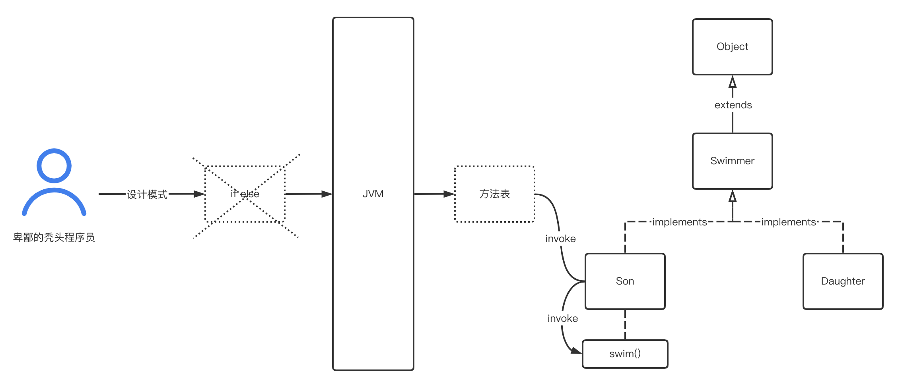
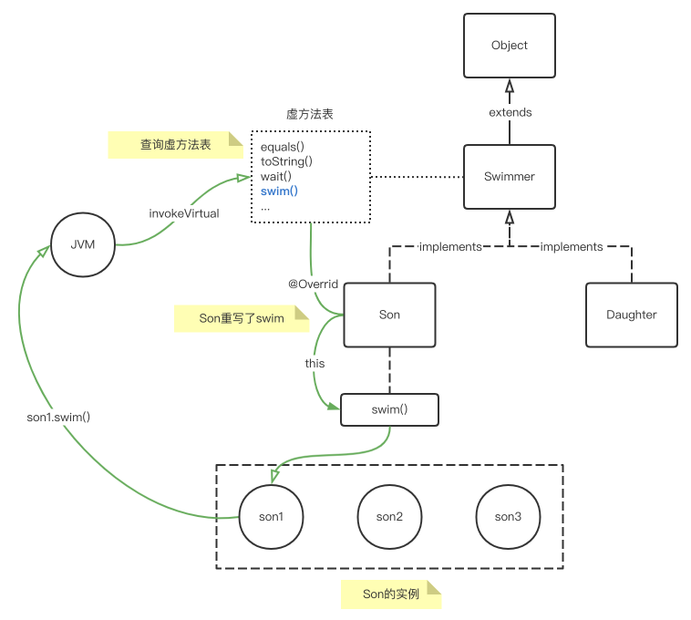

**设计模式本质是围绕着“在面向对象的基础上，如何复用设计”这个原则展开的...所以本质又回到了面向对象。**

  
而在类加载过程中，有loading、linking、initialization三个阶段，其中linking（链接）阶段又包括3个小阶段：  
- verify（验证）  
- prepare（准备）  
- resolve（解析）  
其中在resolve阶段，JVM会针对类或接口、字段、类方法、接口方法等进行相应解析，其中方法信息会形成所谓的“虚方法表”。
虚方法表创建时机是类加载阶段，而所谓类加载，可以认为是类层次的

